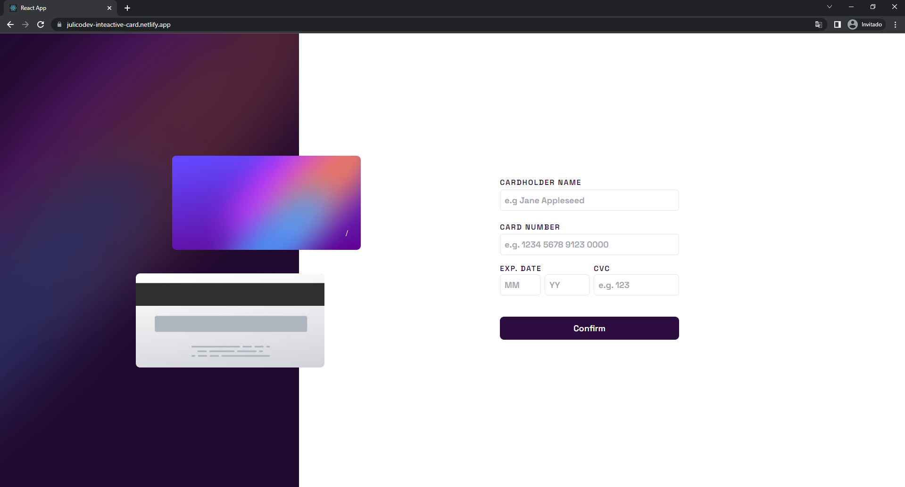
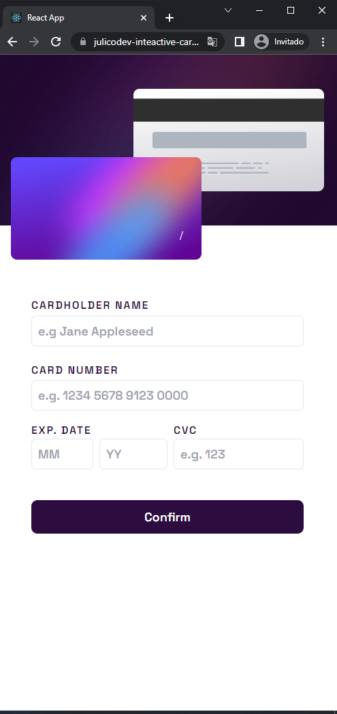

# Interactive Credit Card 💳

[Interactive Credit Card](https://julicodev-inteactive-card.netlify.app/) es un proyecto creado con el fin de poner en práctica habilidades de programación, buenas practicas e implementación de diferentes herramientas para poder cumplir con el desafio [Interactive card details form](https://www.frontendmentor.io/challenges/interactive-card-details-form-XpS8cKZDWw)

[Interactive Credit Card](https://julicodev-inteactive-card.netlify.app/) cuenta con diseño responsivo y validación de los campos del formulario, junto con la tarjeta que muestra los datos que el usuario ingresa en tiempo real.

<div align="center">
  

  
</div>

### Construido con 🛠️
* [Reactjs](https://reactjs.org/) - Una biblioteca de JavaScript para construir interfaces de usuariointerfaces

* [Tailwind](https://tailwindcss.com/) - Un framework de CSS de primera utilidad repleto de clases

## Comenzando 🚀

### Pre-requisitos 📋
Tener instalados npm version 8.5.5 o superior y node.js versión 16.15.0 o superior

```
https://nodejs.org/es/download/
```

### Installación 🔧

Ejecutar la aplicación en el modo de desarrollo.

1. Clone el proyecto

2. Instale las dependencias
```
npm install
```
3. Corra la aplicación
```
npm start
```

Abra [http://localhost:3000](http://localhost:3000) para verlo en su navegador.

La página se volverá a cargar cuando realice cambios.

### Autores 👩‍💻 

* **Juliana García Corredor** - *Desarrollo complerto de la aplicación* - [JuliCoDev](https://github.com/JuliCoDev)